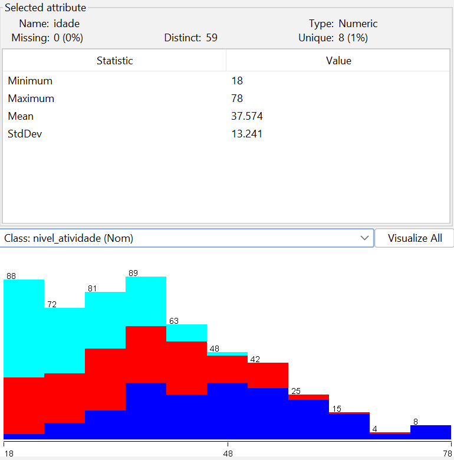
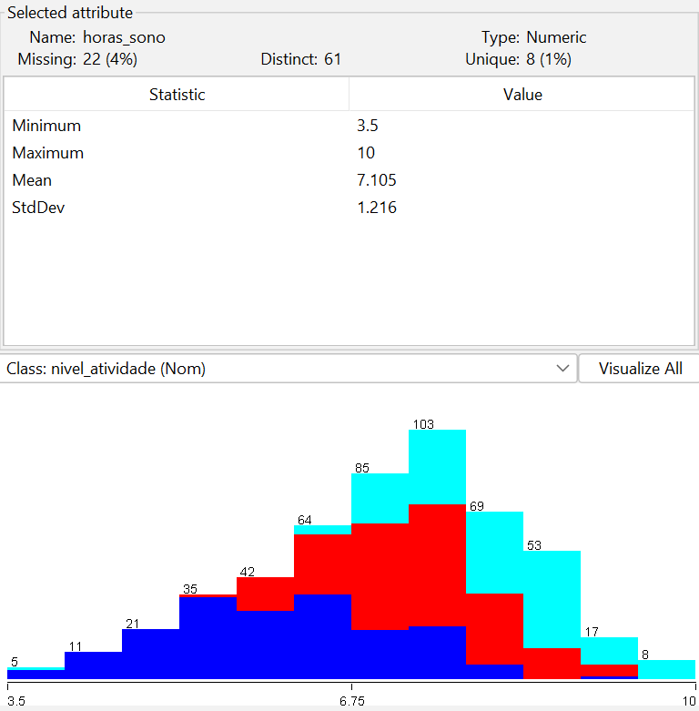
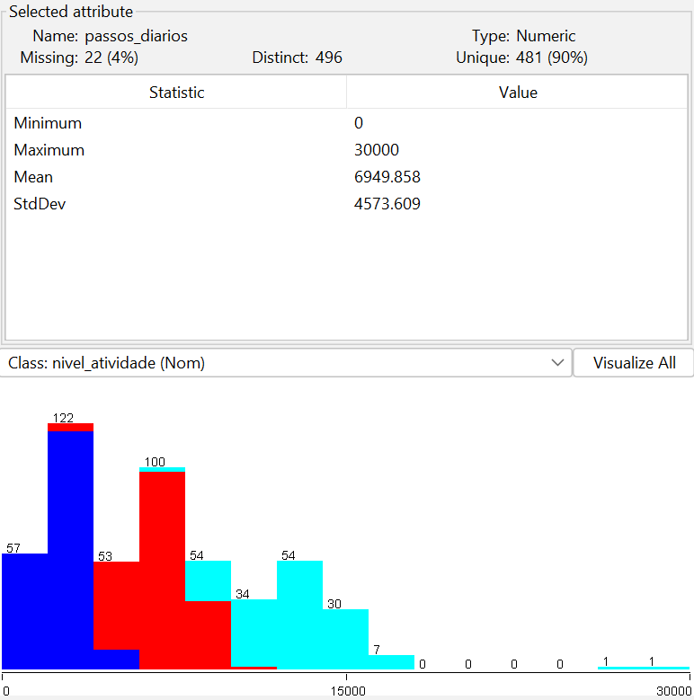
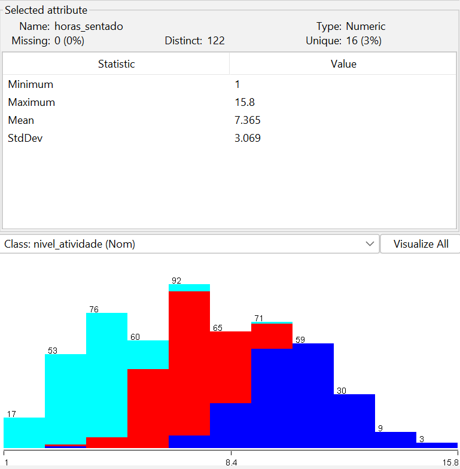
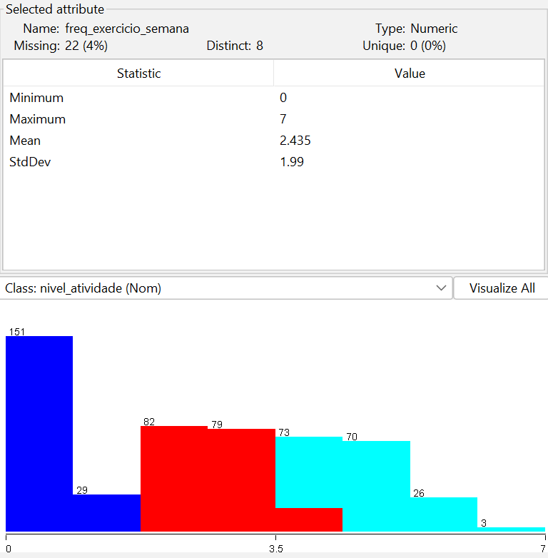
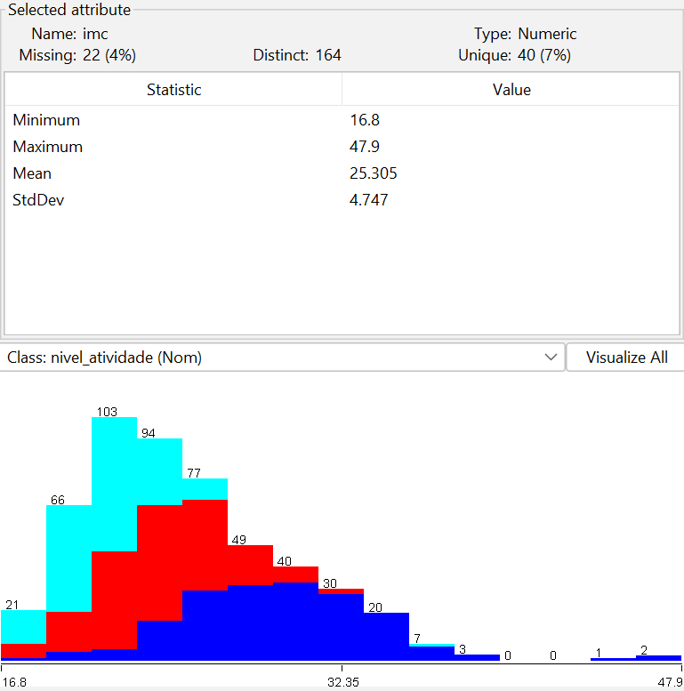
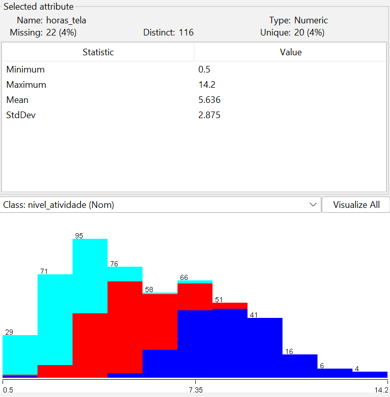
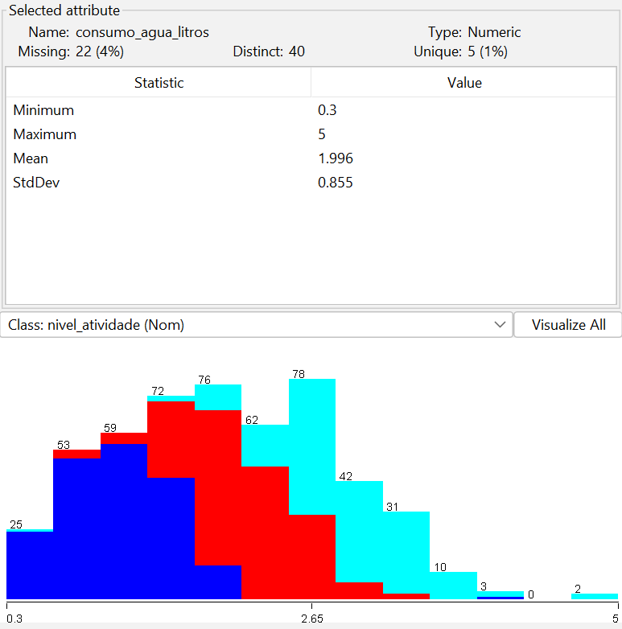
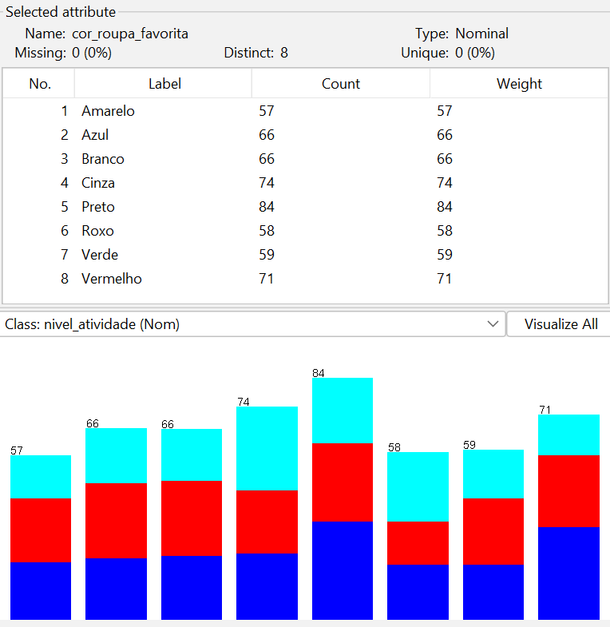
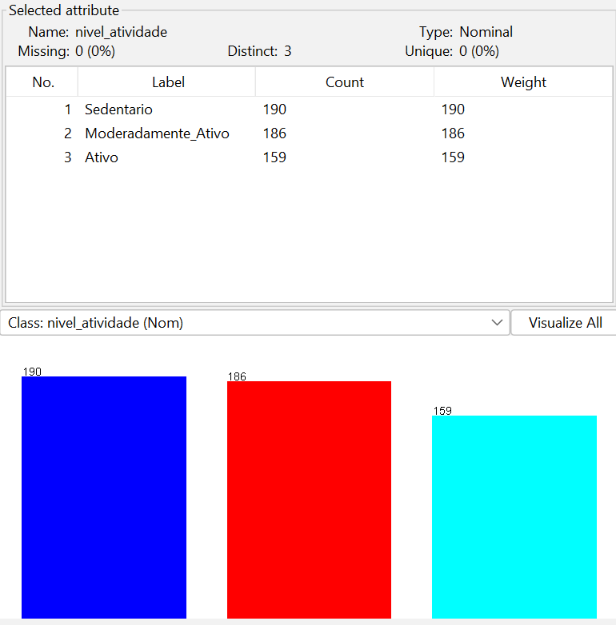

# Etapa 03 — Análise Exploratória Inicial

## 1. Objetivo da Análise Exploratória

Antes da aplicação de qualquer técnica de pré-processamento, foi realizada uma análise exploratória inicial do dataset no Weka.

O objetivo dessa etapa foi:
- investigar o comportamento geral dos dados;
- identificar possíveis inconsistências;
- analisar distribuições dos atributos;
- localizar valores faltantes;
- detectar possíveis outliers;
- compreender relações iniciais entre os atributos e a variável alvo.

Essa análise foi fundamental para orientar as decisões posteriores de pré-processamento, evitando aplicações mecânicas de filtros e transformações.

---

# 2. Visão Geral do Dataset

O dataset original apresentou:

| Característica | Quantidade |
|---|---|
| Instâncias | 535 |
| Atributos | 10 |
| Classes | 3 |

A variável alvo do problema foi:

```txt
nivel_atividade
```

com as seguintes categorias:

- Sedentario
- Moderadamente_Ativo
- Ativo

---

# 3. Análise dos Atributos

Os atributos numéricos analisados foram:

- idade



- horas_sono



- passos_diarios



- horas_sentado



- freq_exercicio_semana



- imc



- horas_tela



- consumo_agua_litros



Além disso, o dataset apresentou os atributos nominais:

- cor_roupa_favorita



- nivel_atividade



Durante a inspeção inicial no Weka foram observadas:
- médias;
- desvios padrão;
- valores mínimos;
- valores máximos;
- distribuições dos atributos.

Essas informações permitiram compreender melhor o comportamento estatístico do conjunto de dados.

---

# 4. Identificação de Valores Faltantes

A análise inicial identificou presença de valores ausentes em diferentes atributos do dataset.

Os atributos com valores faltantes foram:

- horas_sono
- passos_diarios
- freq_exercicio_semana
- imc
- horas_tela
- consumo_agua_litros

Cada um desses atributos apresentou aproximadamente:

```txt
22 valores faltantes = ~4%
```

A presença desses valores indicou a necessidade de aplicação de técnicas de tratamento durante o pré-processamento.

---

# 5. Identificação de Outliers

Também foram identificados possíveis outliers em alguns atributos numéricos.

## 5.1 passos_diarios

O atributo apresentou:
- mínimo: 0
- máximo: 30000
- média aproximada: 6949

Os valores extremos indicaram presença de instâncias distantes da distribuição principal dos dados.

---

## 5.2 imc

O atributo IMC apresentou valores elevados, chegando a:

```txt
47.9
```

Esse comportamento também caracterizou possíveis outliers fisiológicos.

---

## 5.3 horas_tela

O atributo `horas_tela` apresentou valores de até:

```txt
14.2 horas
```

indicando comportamentos extremos relacionados ao uso de telas.

---

# 6. Identificação de Atributo Irrelevante

O atributo:

```txt
cor_roupa_favorita
```

foi identificado como irrelevante para o problema de classificação do nível de atividade física.

Esse atributo não apresentou relação lógica com hábitos físicos, saúde ou comportamento sedentário.

Sua presença foi planejada para simular cenários reais em que bases de dados contêm variáveis sem relevância preditiva.

---

# 7. Distribuição das Classes

A distribuição das classes apresentou equilíbrio relativamente adequado:

| Classe | Quantidade |
|---|---|
| Sedentario | 190 |
| Moderadamente_Ativo | 186 |
| Ativo | 159 |

Essa distribuição reduziu problemas relacionados a desbalanceamento severo entre categorias.

---

# 8. Presença de Ruído

Durante a análise exploratória também foram observadas possíveis inconsistências entre atributos e classes.

Algumas instâncias apresentaram:
- valores parcialmente contraditórios;
- sobreposição entre perfis;
- comportamentos intermediários.

Esses ruídos foram inseridos propositalmente para tornar o problema mais próximo de situações reais de aprendizado de máquina.

---

# 9. Considerações da Análise Inicial

A análise exploratória mostrou que o dataset apresentava:
- boa diversidade entre os atributos;
- separação parcial entre as classes;
- presença controlada de problemas reais de dados.

Os principais desafios identificados foram:
- valores faltantes;
- outliers;
- ruídos;
- presença de atributo irrelevante.

As observações realizadas nessa etapa foram fundamentais para orientar as estratégias adotadas posteriormente durante o pré-processamento do conjunto de dados.

---

# 10. Prints e Evidências

Os prints gerados durante a análise exploratória foram armazenados na pasta: ([imagens](../imagens/prints_weka))

```txt
/imagens/prints_weka 
```


incluindo:
- visão geral do dataset;
- estatísticas dos atributos;
- identificação de valores faltantes;
- distribuições observadas no Weka.