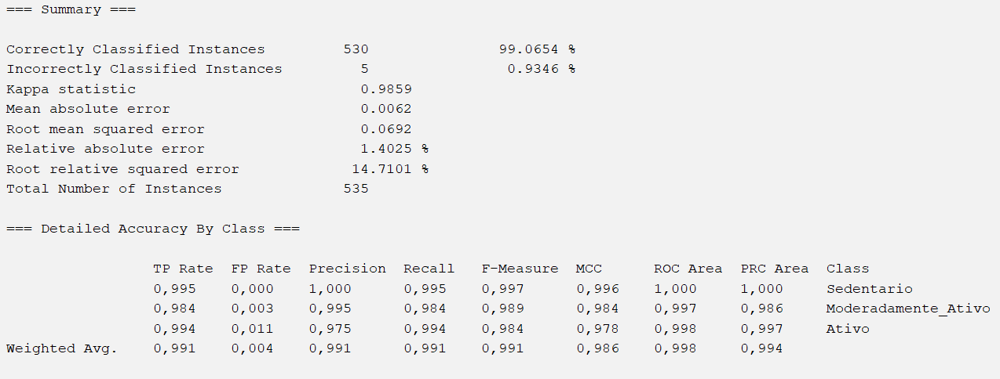
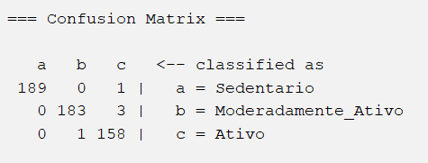

# Etapa 06 — Classificação dos Dados

## 1. Objetivo da Classificação

A etapa de classificação teve como objetivo treinar e avaliar diferentes algoritmos de aprendizado de máquina utilizando o Weka para prever corretamente o nível de atividade física dos indivíduos.

Os modelos foram avaliados utilizando o dataset previamente pré-processado, contendo:
- tratamento de valores faltantes;
- remoção de atributo irrelevante;
- normalização dos atributos numéricos;
- manutenção dos outliers.

A variável alvo utilizada foi:

```txt
nivel_atividade
```

com as classes:
- Sedentario
- Moderadamente_Ativo
- Ativo

---

# 2. Estratégia de Avaliação

Todos os algoritmos foram avaliados utilizando:

```txt
10-fold Cross-validation
```

Essa técnica divide o conjunto de dados em 10 partes, utilizando:
- 9 partes para treinamento;
- 1 parte para teste.

O processo é repetido 10 vezes, garantindo que todas as instâncias sejam utilizadas tanto para treinamento quanto para validação.

A utilização de validação cruzada foi escolhida por:
- apresentar maior confiabilidade estatística;
- reduzir dependência de uma única divisão treino/teste;
- aproveitar melhor o conjunto de dados disponível.

---

# 3. Algoritmos Utilizados

Os algoritmos avaliados foram:

| Algoritmo | Categoria |
|---|---|
| J48 | Árvore de decisão |
| RandomForest | Ensemble |
| NaiveBayes | Probabilístico |
| IBk | Baseado em similaridade |
| OneR | Regras simples |

Cada algoritmo foi analisado individualmente considerando:
- funcionamento;
- interpretabilidade;
- desempenho;
- matriz de confusão;
- capacidade de generalização.

---

# 4. J48 (Árvore de Decisão)

## 4.1 Introdução

O algoritmo J48, implementação da árvore de decisão C4.5 no Weka, foi utilizado para classificação supervisionada do nível de atividade física.

Esse algoritmo constrói árvores de decisão utilizando regras geradas a partir dos atributos do conjunto de dados, permitindo identificar padrões e relações entre as variáveis utilizadas.

Uma das principais vantagens do J48 é sua interpretabilidade, já que o modelo pode ser visualizado em forma de árvore, facilitando a compreensão das decisões tomadas pelo classificador.

---

## 4.2 Configuração

Configuração utilizada:
- algoritmo: J48;
- método de validação: 10-fold Cross-validation;
- parâmetros: padrão do Weka.


---

## 4.3 Resultados

O algoritmo apresentou os seguintes resultados:

| Métrica | Resultado |
|---|---|
| Acurácia | 97,757% |
| Instâncias corretas | 523 |
| Instâncias incorretas | 12 |
| Estatística Kappa | 0,9663 |


A árvore gerada mostrou que o atributo `freq_exercicio_semana` foi o principal critério utilizado para separação das classes.

Outros atributos relevantes identificados foram:
- passos_diarios;
- horas_sentado;
- horas_tela.

A árvore apresentou:
- 8 folhas;
- tamanho total igual a 15 nós.


---

## 4.4 Matriz de Confusão


A matriz de confusão mostrou excelente desempenho do modelo, com poucos erros de classificação.

Os principais erros ocorreram entre:
- `Ativo`
- `Moderadamente_Ativo`

comportamento esperado devido à proximidade entre os padrões dessas categorias.

---

# 5. RandomForest

## 5.1 Introdução

O algoritmo RandomForest foi utilizado como técnica de classificação supervisionada baseada em múltiplas árvores de decisão.

Diferente do J48, que utiliza apenas uma árvore, o RandomForest cria diversas árvores aleatórias durante o treinamento e combina seus resultados por votação.

Essa abordagem reduz problemas de overfitting e aumenta a robustez do modelo.

---

## 5.2 Configuração

Configuração utilizada:
- algoritmo: RandomForest;
- método de validação: 10-fold Cross-validation;
- número de árvores: 100;
- parâmetros restantes: padrão do Weka.


---

## 5.3 Resultados

O algoritmo apresentou os seguintes resultados:

| Métrica | Resultado |
|---|---|
| Acurácia | 99,6262% |
| Instâncias corretas | 533 |
| Instâncias incorretas | 2 |
| Estatística Kappa | 0,9944 |

O RandomForest apresentou o melhor desempenho geral entre todos os algoritmos avaliados.


---

## 5.4 Matriz de Confusão


A matriz de confusão mostrou desempenho praticamente perfeito para as classes:
- `Sedentario`;
- `Ativo`.

Os únicos erros ocorreram entre:
- `Moderadamente_Ativo`


---

# 6. NaiveBayes

## 6.1 Introdução

O algoritmo NaiveBayes foi utilizado para classificação supervisionada baseada em probabilidades condicionais.

O modelo utiliza o Teorema de Bayes e assume independência entre os atributos do conjunto de dados.

Durante o treinamento, o algoritmo calcula médias e desvios padrão dos atributos para cada classe, estimando probabilidades de pertencimento às categorias do problema.

---

## 6.2 Configuração

Configuração utilizada:
- algoritmo: NaiveBayes;
- método de validação: 10-fold Cross-validation;
- parâmetros: padrão do Weka.

---

## 6.3 Resultados

O algoritmo apresentou os seguintes resultados:

| Métrica | Resultado |
|---|---|
| Acurácia | 99,0654% |
| Instâncias corretas | 530 |
| Instâncias incorretas | 5 |
| Estatística Kappa | 0,9859 |

Os atributos que apresentaram maior diferença estatística entre as classes foram:
- freq_exercicio_semana;
- horas_tela;
- passos_diarios;
- horas_sentado.



---

## 6.4 Matriz de Confusão



Os principais erros ocorreram entre:
- `Ativo`
- `Moderadamente_Ativo`.

A classe `Sedentario` apresentou excelente separação em relação às demais.

---

# 7. IBk (K-Nearest Neighbors)

## 7.1 Introdução

O algoritmo IBk, implementação do método K-Nearest Neighbors (KNN) no Weka, realiza classificações utilizando similaridade entre instâncias.

O modelo classifica novos exemplos com base nos vizinhos mais próximos presentes no conjunto de treinamento.

Como utiliza cálculos de distância entre atributos, a etapa de normalização dos dados foi fundamental para melhorar seu desempenho.


---

## 7.2 Configuração

Configuração utilizada:
- algoritmo: IBk;
- método de validação: 10-fold Cross-validation;
- K = 1;
- parâmetros restantes: padrão do Weka.


---

## 7.3 Resultados

O algoritmo apresentou os seguintes resultados:

| Métrica | Resultado |
|---|---|
| Acurácia | 98,6916% |
| Instâncias corretas | 528 |
| Instâncias incorretas | 7 |
| Estatística Kappa | 0,9803 |

O desempenho elevado mostrou que indivíduos pertencentes à mesma classe apresentaram forte proximidade no espaço dos atributos.


---

## 7.4 Matriz de Confusão


Os erros observados ocorreram principalmente entre:
- `Moderadamente_Ativo`
- `Ativo`.

---

# 8. OneR

## 8.1 Introdução

O algoritmo OneR (One Rule) é um classificador baseado em regras simples, cujo objetivo é gerar decisões utilizando apenas um único atributo do conjunto de dados.

O modelo avalia todos os atributos disponíveis e seleciona aquele que produz a menor taxa de erro durante a classificação.

---

## 8.2 Configuração

Configuração utilizada:
- algoritmo: OneR;
- método de validação: 10-fold Cross-validation;
- parâmetros: padrão do Weka.


---

## 8.3 Resultados

O OneR identificou que o atributo mais relevante para classificação foi:

```txt
freq_exercicio_semana
```

As regras produzidas foram:

```txt
freq_exercicio_semana < 0.214  -> Sedentario
freq_exercicio_semana < 0.316  -> Moderadamente_Ativo
freq_exercicio_semana < 0.388  -> Sedentario
freq_exercicio_semana < 0.5    -> Moderadamente_Ativo
freq_exercicio_semana >= 0.5   -> Ativo
```


Resultados obtidos:

| Métrica | Resultado |
|---|---|
| Acurácia | 94,39% |
| Instâncias corretas | 505 |
| Instâncias incorretas | 30 |
| Estatística Kappa | 0,9158 |

Mesmo utilizando apenas um atributo, o algoritmo apresentou desempenho elevado.


---

## 8.4 Matriz de Confusão


A maior quantidade de erros ocorreu na classe:
- `Moderadamente_Ativo`.

Esse comportamento era esperado devido à natureza intermediária dessa categoria.

---

# 9. Considerações Gerais

Os resultados mostraram que todos os algoritmos apresentaram desempenho elevado no conjunto de dados analisado.

Os principais atributos responsáveis pela separação entre as classes foram:
- freq_exercicio_semana;
- passos_diarios;
- horas_sentado;
- horas_tela.

Os algoritmos RandomForest e NaiveBayes apresentaram os melhores resultados gerais, enquanto o J48 destacou-se pela interpretabilidade do modelo gerado.

Além disso, os experimentos mostraram que o dataset apresentou padrões consistentes e coerentes com o problema proposto, permitindo excelente desempenho dos classificadores avaliados.

---

# 10. Evidências e Prints

Os prints gerados durante a etapa de classificação foram armazenados em: ([imagens](../imagens/algoritmos))

```txt
/imagens/prints_algoritmos
```

incluindo:
- configuração dos algoritmos;
- árvores geradas;
- métricas de desempenho;
- matrizes de confusão;
- resultados de validação cruzada.