# Descrição das Etapas Realizadas


Este trabalho aborda um problema de classificação supervisionada aplicado à estimativa do nível de atividade física de indivíduos. O objetivo é classificar uma pessoa em uma das três categorias: Sedentário, Moderadamente Ativo ou Ativo, a partir de atributos relacionados ao estilo de vida, saúde e rotina diária.

As entradas do modelo correspondem a características como idade, horas de sono, número médio de passos diários, horas sentado por dia, frequência semanal de exercício físico, índice de massa corporal, horas de tela e consumo de água. A saída esperada é a classe `nivel_atividade`, que representa o nível geral de atividade física do indivíduo.

Esse problema é relevante porque o nível de atividade física está associado a hábitos de vida, prevenção de doenças e qualidade de saúde. A classificação automática pode auxiliar na identificação de perfis sedentários ou ativos, permitindo análises sobre padrões comportamentais e possíveis fatores associados à prática de atividade física.

A tarefa escolhida é a classificação, pois o objetivo é prever uma categoria discreta previamente definida. O problema apresenta desafios como a presença de valores faltantes, ruídos, outliers e atributos irrelevantes, exigindo etapas cuidadosas de análise exploratória, pré-processamento e avaliação dos modelos.

## 3. Fundamentação Teórica

## 4. Geração do Dataset

## 5. Análise Exploratória Inicial

## 6. Pré-processamento
O pré-processamento foi realizado com o objetivo de preparar o dataset para a etapa de modelagem no Weka, corrigindo problemas identificados durante a análise exploratória inicial e tornando os dados mais adequados para os algoritmos de aprendizado de máquina.

As decisões tomadas nesta etapa foram guiadas pelas evidências observadas na análise inicial, especialmente a presença de valores faltantes, diferenças de escala entre atributos numéricos, existência de atributo irrelevante e presença de possíveis outliers.

---
### Etapa 6.1 — Dataset Utilizado
O pré-processamento foi aplicado sobre o arquivo: 

```ruby
dataset_original.arff
```

O dataset original possuía:
- 535 instâncias;
- 10 atributos;
- 8 atributos numéricos;
- 2 atributos nominais;
- variável alvo: `nivel_atividade`.

Após o pré-processamento, o dataset foi salvo como:

```ruby
dataset_preprocessado.arff
```
### Etapa 6.2 — Tratamento de Valores Faltantes
Durante a análise inicial no Weka, foram identificados valores faltantes em diferentes atributos numéricos do dataset.
Os atributos com valores ausentes foram:
- `horas_sono`
- `passos_diarios`
- `freq_exercicio_semana`
- `mc`
- `horas_tela`
- `consumo_agua_litros`

Cada um desses atributos apresentou aproximadamente 22 valores faltantes, correspondendo a cerca de 4% do total de instâncias.

Para tratar esses valores, foi aplicado o filtro:

```ruby
filters → unsupervised → attribute → ReplaceMissingValues
```
Esse filtro substitui valores faltantes em atributos numéricos pela média dos valores observados no respectivo atributo. A escolha por essa abordagem foi feita para preservar o número total de instâncias do dataset, evitando a remoção de registros e reduzindo a perda de informação.

Após a aplicação do filtro, os atributos passaram a apresentar 0% de valores faltantes.

### Etapa 6.3 — Remoção de Atributo Irrelevante
O atributo `cor_roupa_favorita` foi identificado como irrelevante para o problema de classificação do nível de atividade física.

Esse atributo não possui relação lógica direta com hábitos físicos, estilo de vida, saúde ou comportamento sedentário. Por isso, sua permanência poderia introduzir ruído no processo de aprendizagem dos algoritmos.

A remoção foi feita manualmente no Weka, selecionando o atributo e utilizando a opção:

```ruby
Remove
```

Após essa etapa, o dataset passou de 10 para 9 atributos.

### Etapa 6.4 — Tratamento de Outliers
Durante a análise exploratória inicial, foram identificados possíveis outliers em alguns atributos.

Exemplos observados:

`passos_diarios`: valores variando de 0 até 30000 passos;
imc: valor máximo de 47.9;
horas_tela: valor máximo de 14.2 horas.

Esses valores foram considerados comportamentos extremos ou discrepantes em relação à distribuição principal dos dados.

No entanto, optou por manter os outliers no dataset. Essa decisão foi tomada porque o conjunto de dados foi projetado para simular situações próximas de bases reais, nas quais valores extremos podem ocorrer. Além disso, a manutenção dos outliers permite avaliar a robustez dos algoritmos diante de dados ruidosos e imperfeitos.

Portanto, os outliers foram analisados e documentados, mas não removidos.

### Etapa 6.5 — Normalização dos Atributos Numéricos
Os atributos numéricos apresentavam escalas muito diferentes. Por exemplo, enquanto `consumo_agua_litros` variava aproximadamente entre 0.3 e 5, o atributo `passos_diarios` variava entre 0 e 30000.

Essa diferença de escala poderia prejudicar algoritmos sensíveis à magnitude dos atributos, especialmente algoritmos baseados em distância.

Para reduzir esse problema, foi aplicado o filtro:

```ruby
filters → unsupervised → attribute → Normalize
```
As configurações padrão foram mantidas:

```ruby
scale = 1.0
translation = 0.0
```

Com isso, os atributos numéricos foram normalizados para a faixa de 0 a 1. A variável alvo `nivel_atividade` não foi alterada, pois é um atributo nominal de classe.

### Etapa 6.5 — Aplicação de Filtro Adicional do Weka
Além dos filtros básicos de tratamento e transformação, foi aplicado o filtro:

```ruby
filters → unsupervised → attribute → RemoveUseless
```
Esse filtro tem como objetivo identificar e remover atributos considerados inúteis, com pouca ou nenhuma variação.

A aplicação desse filtro foi incluída para atender ao requisito de utilizar pelo menos um filtro adicional do Weka não explorado em sala.

Após sua execução, nenhum atributo adicional foi removido. Isso indica que os atributos restantes possuíam variabilidade suficiente e não foram considerados inúteis pelo filtro.

### Etapa 6.5 — Pipeline Final de Pré-processamento
O pipeline final aplicado ao dataset foi:

```
1. ReplaceMissingValues
2. Remove do atributo cor_roupa_favorita
3. Normalize
4. RemoveUseless
```
Ao final do processo, o dataset permaneceu com:
- 535 instâncias;
- 9 atributos;
- 0 valores faltantes;
- atributos numéricos normalizados;
- classe nominal preservada.

O dataset final foi salvo como:

```ruby
dataset_preprocessado.arff
```
### Etapa 6.5 — Justificativa Geral do Pré-processo
As etapas de pré-processamento foram realizadas com o objetivo de tornar o dataset mais adequado à aplicação de algoritmos de classificação no Weka.

A substituição dos valores faltantes evitou perda de dados, a remoção do atributo irrelevante reduziu ruído, a normalização padronizou as escalas dos atributos numéricos e a aplicação do filtro RemoveUseless permitiu verificar a existência de atributos sem utilidade após as transformações.

Dessa forma, o pré-processamento foi conduzido de maneira planejada e fundamentada, evitando alterações mecânicas ou sem justificativa.

## 7. Visualização dos Dados
### 7.1 — Primeira Visualização
A primeira visualização foi entre X: `passos_diarios` e Y: `freq_exercicio_semana`, como podemos visualizar na imagem a seguir:

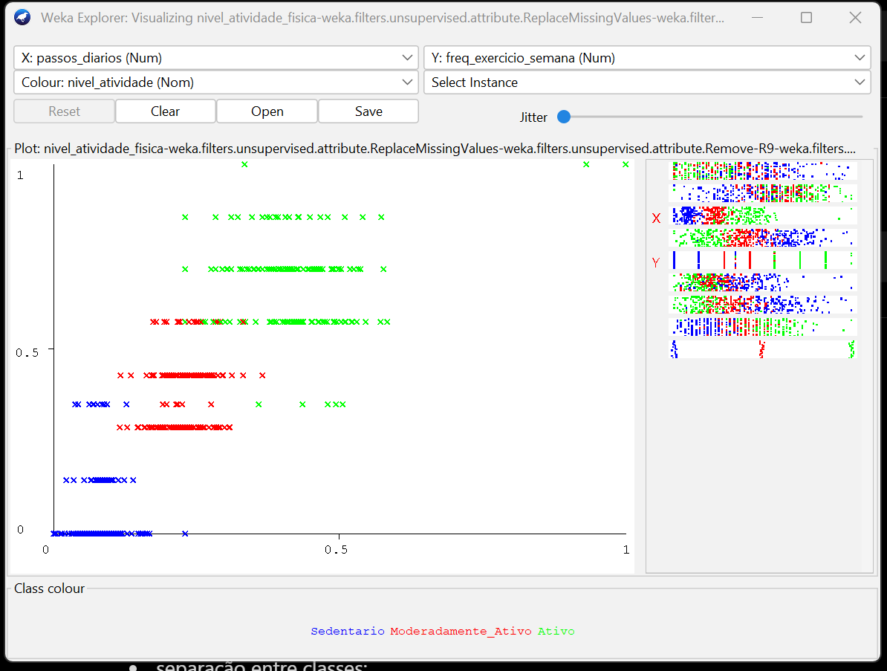

A visualização de dispersão entre os atributos `passos_diarios` e `freq_exercicio_semana` demonstrou uma separação parcial entre as classes do problema. Observamos que indivíduos classificados como `sedentários` concentram em regiões com menor frequência de exercícios e menor quantidade de passos diários, enquanto indivíduos `ativos` aparecem majoritariamente em regiões de valores mais elevados.

Os indivíduos `moderadamente ativos` ocuparam regiões intermediárias, indicando uma transição gradual entre os perfis comportamentais. Esses padrões sugerem que os atributos analisados possuem relevância para o processo de classificação.

### 7.2 — Segunda Avaliação
A segunda visualização foi entre X: `horas_sentado` e Y: `horas_tela`, como podemos visualizar na imagem a seguir:

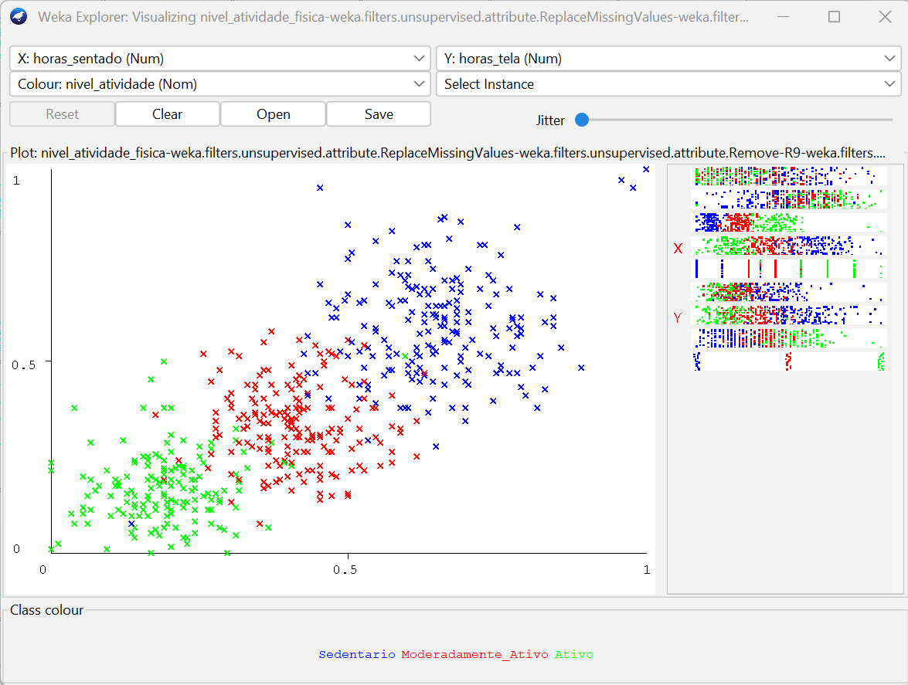

A visualização entre os atributos `horas_sentado` e `horas_tela` apresentou uma separação mais evidente entre as classes do problema. Os indivíduos sedentários concentraram majoritariamente em regiões com maiores valores de tempo sentado e maior exposição a telas, enquanto indivíduos ativos apareceram em regiões com menores valores para ambos os atributos.

Os indivíduos moderadamente ativos permaneceram distribuídos em regiões intermediárias, indicando uma transição gradual entre os perfis. A distribuição observada sugere forte relação entre comportamento sedentário e nível de atividade física, reforçando a relevância desses atributos para a tarefa de classificação.

### 7.3 — Terceira Avaliação
A terceira visualização foi entre X: `imc` e Y: `passos_diarios`, como podemos visualizar na imagem a seguir:

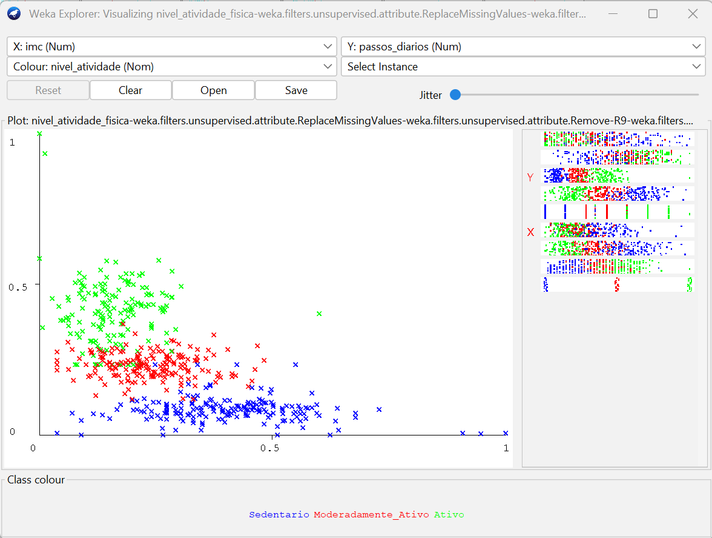

A visualização entre os atributos `imc` e `passos_diarios` apresentou maior sobreposição entre as classes quando comparada às demais visualizações analisadas. Embora exista tendência de indivíduos ativos apresentarem maior quantidade de passos diários e sedentários concentrarem em regiões inferiores, observou dispersão significativa entre os grupos.

Essa sobreposição indica que o problema de classificação não é perfeitamente separável apenas com esses atributos, tornando o cenário mais próximo de aplicações reais de aprendizado de máquina. Além disso, o gráfico evidenciou a presença de possíveis outliers e comportamentos discrepantes, especialmente em regiões extremas da distribuição.

### 7.4 — Quarta Avaliação
A quarta visualização foi entre X: `horas_sono` e Y: `horas_tela`, como podemos visualizar na imagem a seguir:

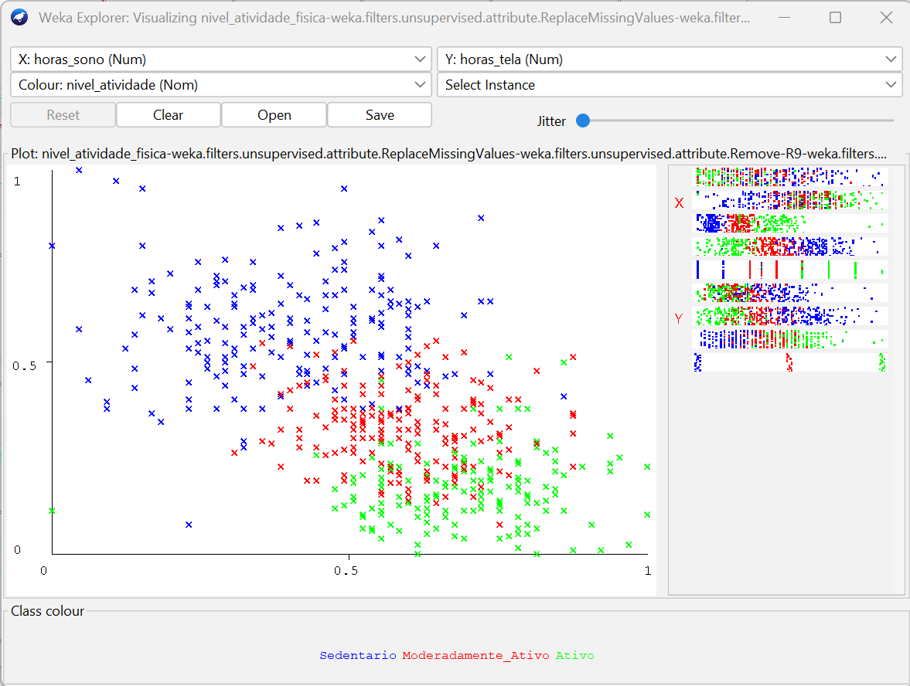


A visualização entre os atributos `horas_sono` e `horas_tela` evidenciou padrões distintos entre as classes do problema. Observou que indivíduos sedentários concentraram em regiões associadas a maior tempo de exposição a telas e menores valores de horas de sono, enquanto indivíduos ativos apresentaram comportamento oposto.

Os indivíduos moderadamente ativos permaneceram distribuídos em regiões intermediárias, reforçando a ideia de transição gradual entre os perfis de atividade física. O gráfico sugere relação inversa parcial entre tempo de tela e horas de sono no conjunto de dados analisado.

### 7.5 — Quinta Avaliação
A quinta visualização foi entre X: `idade` e Y: `freq_exercicio_semana`, como podemos visualizar na imagem a seguir:

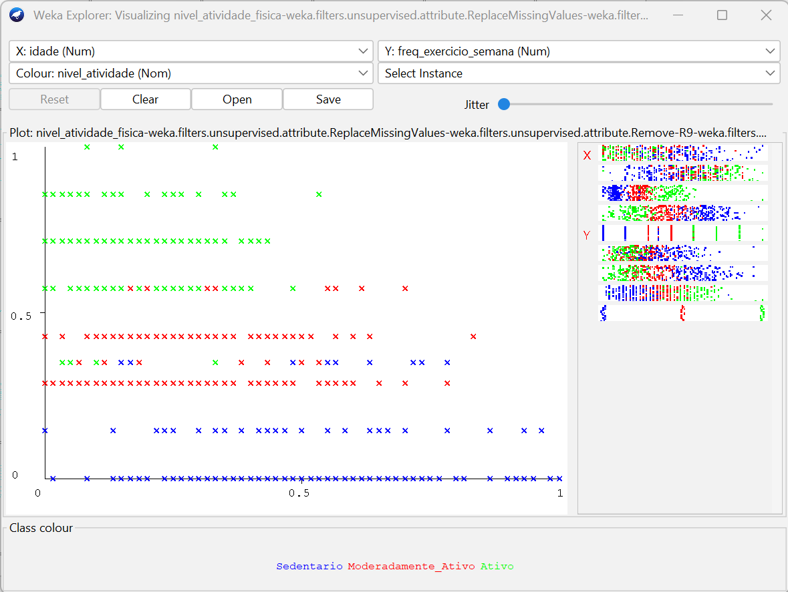

A visualização entre os atributos `idade` e `freq_exercicio_semana` mostrou que a frequência de exercícios possui relação mais evidente com o nível de atividade física, enquanto a idade apresentou maior dispersão entre as classes.

Indivíduos sedentários concentraram principalmente em baixas frequências de exercício, enquanto indivíduos ativos apareceram em frequências mais elevadas. Entretanto, a distribuição da idade ocorreu de forma espalhada entre todas as classes, indicando que esse atributo isoladamente não é suficiente para separar os grupos de forma clara.

Esse comportamento reforça a necessidade de utilização conjunta de múltiplos atributos durante o processo de classificação.

## 8. Treino e Teste dos Modelos
### 8.1 — J48 (Árvore de Decisão)
#### 8.1.1 — Introdução do algoritmo
O algoritmo J48, implementação da árvore de decisão C4.5 no Weka, foi utilizado para classificação supervisionada do nível de atividade física. Esse algoritmo constrói árvores de decisão a partir de regras geradas pelos atributos do conjunto de dados, permitindo identificar padrões e relações entre as variáveis utilizadas.

Uma das principais vantagens do J48 é sua interpretabilidade, já que o modelo gerado pode ser visualizado em forma de árvore, facilitando a compreensão das decisões tomadas pelo classificador.

#### 8.1.2 — Configuração usada
O modelo foi avaliado utilizando validação cruzada estratificada com 10 folds (10-fold cross-validation), técnica amplamente utilizada para avaliação de modelos de aprendizado de máquina. Essa abordagem divide o conjunto de dados em dez partes, utilizando nove partes para treinamento e uma para teste, repetindo o processo até que todas as partes tenham sido utilizadas para validação.

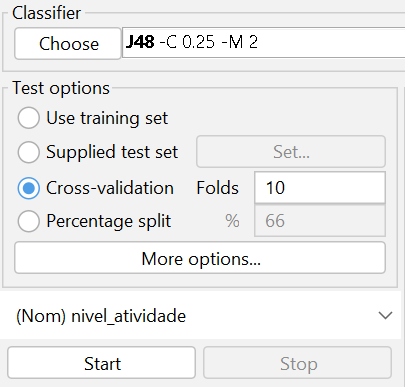

#### 8.1.3 — Interpretação da árvore
A árvore gerada pelo algoritmo mostrou que o atributo `freq_exercicio_semana` foi o principal critério utilizado para separação das classes. Indivíduos com baixa frequência de exercícios foram classificados predominantemente como sedentários, enquanto atributos como `passos_diarios`, `horas_sentado` e `horas_tela` contribuíram para distinguir indivíduos moderadamente ativos e ativos.

A árvore apresentou 8 folhas e tamanho total igual a 15 nós, indicando um modelo relativamente simples e interpretável, como podemos ver na imagem a seguir:

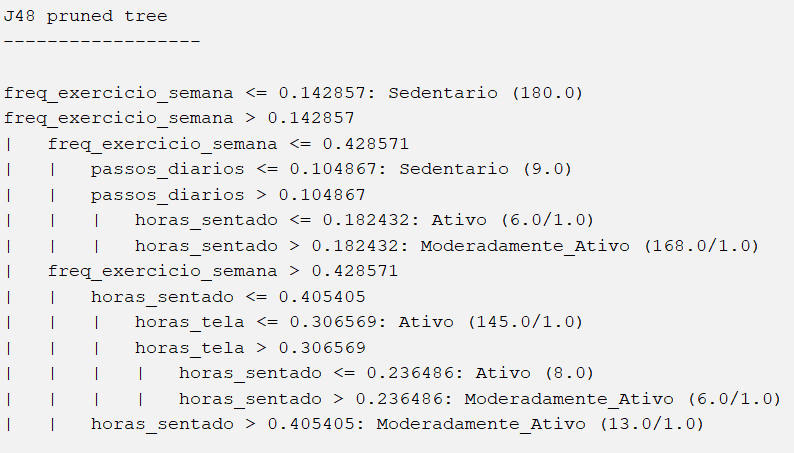

#### 8.1.4 — Resultados

O algoritmo J48 obteve excelente desempenho no conjunto de dados analisado, alcançando taxa de acerto de 97,757%, com apenas 12 instâncias classificadas incorretamente entre as 535 avaliadas.

O valor da estatística Kappa foi de 0,9663, indicando alta concordância entre as classificações previstas pelo modelo e as classes reais do conjunto de dados.

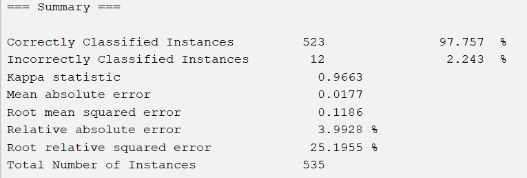

#### 8.1.4 — Matriz de Confusão
A matriz de confusão mostrou que a maior parte dos erros ocorreu entre as classes `Ativo` e `Moderadamente_Ativo`, comportamento esperado devido à proximidade entre os padrões dessas categorias. A classe `Sedentario` apresentou excelente separação, com apenas um erro de classificação.

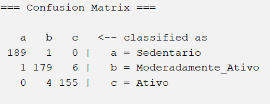

### 8.2 — RandomForest
#### 8.2.1 — Introdução
O algoritmo RandomForest foi utilizado como técnica de classificação supervisionada para o problema proposto. Esse algoritmo é baseado em um conjunto de múltiplas árvores de decisão, combinando os resultados individuais de cada árvore para produzir uma classificação final mais robusta e precisa.

Diferentemente do J48, que utiliza apenas uma única árvore de decisão, o RandomForest cria diversas árvores aleatórias durante o treinamento, reduzindo problemas de overfitting e aumentando a capacidade de generalização do modelo.

#### 8.2.2 — Configuração
O modelo foi avaliado utilizando validação cruzada estratificada com 10 folds. A configuração padrão do Weka foi mantida, utilizando 100 árvores no processo de treinamento do RandomForest.

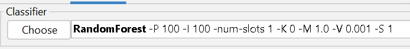

#### 8.2.3 — Resultados
O algoritmo RandomForest apresentou desempenho extremamente elevado, alcançando taxa de acerto de 99,6262%, com apenas 2 instâncias classificadas incorretamente entre as 535 avaliadas.

A estatística Kappa obtida foi de 0,9944, indicando concordância quase perfeita entre as classificações previstas pelo modelo e as classes reais do conjunto de dados.


#### 8.2.4 — Matriz de confusão
A matriz de confusão mostrou desempenho praticamente perfeito para as classes `Sedentario` e `Ativo`, sem erros de classificação nessas categorias. Os únicos erros observados ocorreram entre as classes `Moderadamente_Ativo` e `Ativo`, comportamento esperado devido à similaridade parcial entre os padrões dessas classes.

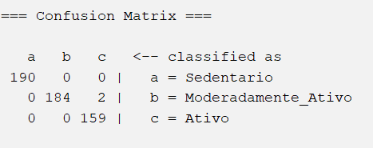

### 8.3 — NaiveBayes
#### 8.3.1 — Introdução
O algoritmo NaiveBayes foi utilizado para classificação supervisionada do nível de atividade física. Esse modelo baseia no Teorema de Bayes e realiza previsões utilizando probabilidades condicionais entre os atributos e as classes do problema.

O NaiveBayes assume independência entre os atributos do conjunto de dados, característica que simplifica o processo de classificação e reduz o custo computacional do modelo.

#### 8.3.2 Funcionamento observado
Durante o treinamento, o algoritmo calculou médias e desvios padrão dos atributos para cada classe do problema, permitindo estimar probabilidades de pertencimento às categorias `Sedentario`, `Moderadamente_Ativo` e `Ativo`.

Os resultados mostraram diferenças estatísticas relevantes entre as classes, principalmente em atributos como `freq_exercicio_semana`, `horas_tela`, `passos_diarios` e `horas_sentado`.


#### 8.3.3 — Resultados
O algoritmo NaiveBayes apresentou desempenho extremamente elevado, alcançando taxa de acerto de 99,0654%, com apenas 5 instâncias classificadas incorretamente entre as 535 avaliadas.

A estatística Kappa obtida foi de 0,9859, indicando excelente concordância entre as previsões realizadas pelo modelo e as classes reais do conjunto de dados.


#### 8.3.4 — Matriz de confusão
A matriz de confusão mostrou que a maioria dos erros ocorreu entre as classes `Ativo` e `Moderadamente_Ativo`, indicando proximidade parcial entre os padrões dessas categorias. A classe `Sedentario` apresentou excelente separação em relação às demais.


### 8.4 — IBk (K-Nearest Neighbors)
#### 8.4.1 — Introdução
O algoritmo IBk, implementação do método K-Nearest Neighbors (KNN) no Weka, foi utilizado para classificação supervisionada do nível de atividade física. Esse algoritmo realiza previsões com base na similaridade entre instâncias, classificando novos exemplos de acordo com os vizinhos mais próximos presentes no conjunto de treinamento.

#### 8.4.2 — Funcionamento
No experimento realizado, foi utilizada a configuração padrão do Weka com K = 1, ou seja, a classificação foi realizada considerando apenas o vizinho mais próximo de cada instância analisada.

Como o algoritmo utiliza cálculos de distância entre atributos numéricos, a etapa de normalização dos dados foi fundamental para evitar que atributos com escalas maiores influenciassem excessivamente os cálculos de similaridade.

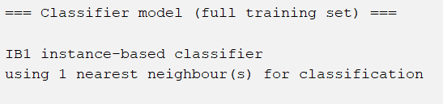

#### 8.4.3 — Resultados
O algoritmo IBk apresentou desempenho elevado no conjunto de dados analisado, alcançando taxa de acerto de 98,6916%, com apenas 7 instâncias classificadas incorretamente entre as 535 avaliadas.

A estatística Kappa obtida foi de 0,9803, indicando excelente concordância entre as previsões realizadas pelo modelo e as classes reais do conjunto de dados.

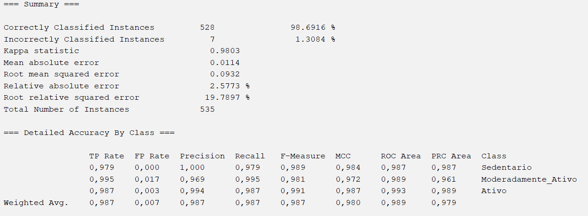

#### 8.4.4 — Matrix de Confusão
A matriz de confusão mostrou excelente separação entre as classes do problema, com poucos erros de classificação. As principais confusões ocorreram entre as classes `Moderadamente_Ativo` e `Ativo`, comportamento coerente devido à proximidade entre os padrões dessas categorias.

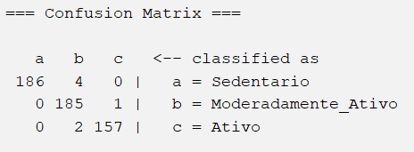

### 8.5 — OneR
#### 8.5.1 — Introdução

O algoritmo `OneR` (One Rule) é um classificador baseado em regras simples, cujo objetivo é gerar decisões utilizando apenas um único atributo do conjunto de dados. O algoritmo avalia todos os atributos disponíveis e seleciona aquele que produz a menor taxa de erro durante a classificação.

Diferente de algoritmos mais complexos, como RandomForest e J48, o OneR busca criar regras diretas e facilmente interpretáveis, funcionando como um modelo de referência (baseline) para comparação com outros classificadores.

Neste trabalho, o algoritmo identificou que o atributo mais relevante para a classificação do nível de atividade física foi `freq_exercicio_semana`, demonstrando forte relação entre frequência semanal de exercícios e a variável alvo.

#### 8.5.2 — Configuração

Para execução do algoritmo no Weka, foram utilizadas as seguintes configurações:

- Algoritmo: OneR
- Classe alvo: `nivel_atividade`
- Método de validação: Cross-validation
- Número de folds: 10
- Configurações adicionais: padrão do Weka

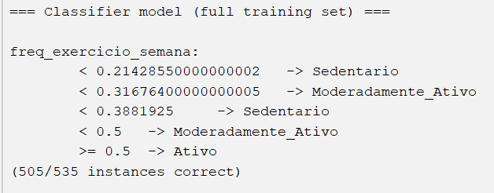

#### 8.5.3 — Resultados

O OneR gerou regras simples utilizando exclusivamente o atributo `freq_exercicio_semana`.

As regras produzidas foram:

```txt
freq_exercicio_semana < 0.214  -> Sedentario
freq_exercicio_semana < 0.316  -> Moderadamente_Ativo
freq_exercicio_semana < 0.388  -> Sedentario
freq_exercicio_semana < 0.5    -> Moderadamente_Ativo
freq_exercicio_semana >= 0.5   -> Ativo
```

O modelo obteve os seguintes resultados:

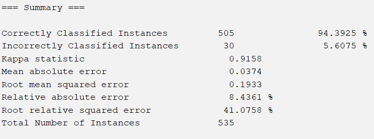

Mesmo utilizando apenas uma variável para classificação, o algoritmo apresentou desempenho elevado, indicando que a frequência semanal de exercícios possui grande capacidade de separação entre as classes analisadas.

Além disso, o resultado reforça que o conjunto de dados apresenta padrões consistentes e bem definidos.

---

# Matriz de Confusão

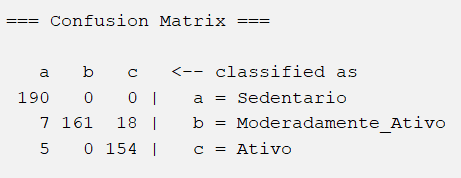

A matriz de confusão demonstra que:
- a classe `Sedentario` foi classificada corretamente em todos os casos;
- a maior quantidade de erros ocorreu na classe `Moderadamente_Ativo`, principalmente por confusão com a classe `Ativo`;
- a classe intermediária apresentou maior dificuldade de separação, comportamento esperado devido à proximidade entre os níveis de atividade física.

Os resultados obtidos mostram que o OneR, mesmo sendo um algoritmo simples, foi capaz de alcançar desempenho significativo na tarefa de classificação do nível de atividade física.

## Comparação Geral 

| Algoritmo         | Acurácia |
|-------------------|----------|
| J48               | 97.75%   |  
| RandomForest      | 99.63%   |  
| NaiveBayes        | 99.06%   | 
| IBk               | 98.69%   | 
| OneR              | 94.39%   | 


## Visão Geral 

| Algoritmo            | Visão     |
|----------------------|-----------|
| J48                  | Mais interpretável. |  
| RandomForest         | Maior desempenho.   |  
| NaiveBayes           | Excelente mesmo sendo probabilístico e simples.    | 
| IBk                  | Ótima separação por similaridade.   |
| OneR                  | Foi o mais simples   | 

## 9. Resultados e Discussão

## 10. Conclusão

## Referências